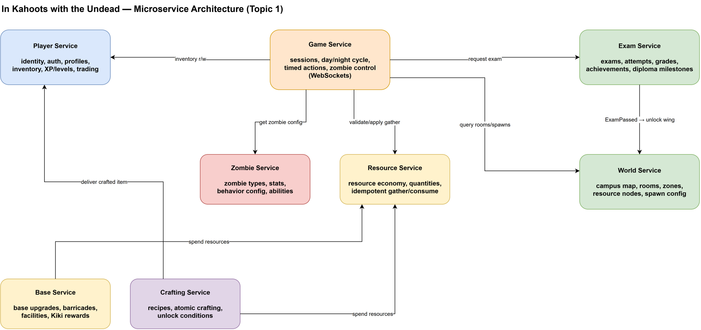

## Kahoot With Undead

A university-themed survival game built as a microservices system. Players wake up in FAF Cab
during a zombie apocalypse and must scavenge resources, build up their base, and fend off zombies —
including Professor Zombies, who force a pop quiz before letting you past. Passing exams unlocks new
wings of the university to explore, tying academic progress directly to survival progress.

## Architecture

- **Player**: identity, auth, profiles, XP/levels, inventory, trading
- **Game**: sessions, day/night cycle, timed actions, zombie encounters
- **Exam**: exam generation, grading, academic history, achievements
- **World**: campus map: wings, rooms, resource nodes, spawn points
- **Zombie**: zombie type definitions, stats, abilities
- **Resource**: per-player resource balances and the gather/spend economy
- **Base**: what players have built: base level, facilities, barricades
- **Crafting**: recipes and crafting, delivering items into Player's inventory

Game orchestrates a session by calling World, Zombie and Exam over REST; Resource, Base and
Crafting react to what Game reports via async events, and publish their own events (level-ups,
exam results, wing unlocks) for services that depend on them. See the [Communication
Contract](docs/communication.md) for the full endpoint and event contract.

## GitHub Workflow

- **Branches**: `main` is protected: no direct pushes, merges only through a reviewed PR, CI must
  pass. `develop` is the integration branch everyone works off; feature work branches off `develop`
  and merges back into it, and `develop` is merged into `main` for releases.
- **Naming**: `feature/<short-description>`, `fix/<short-description>`, `chore/<short-description>`
  (e.g. `feature/resource-reservations`).
- **Merging**: squash merge, PR title becomes the commit message. Requires 1 approval and a
  passing CI run before the merge button unlocks.
- **PR content**: what changed and why, which service(s) it touches, how it was tested, and any
  follow-up work left out of scope. Linked to the relevant task/issue.
- **Test coverage**: new logic needs tests before merge; CI fails the build below the coverage
  threshold. Reviewers can ask for more coverage on a case-by-case basis.
- **Versioning**: semantic versioning per service (`MAJOR.MINOR.PATCH`), tagged on `main` at each
  release. Breaking API/event changes bump `MAJOR`.

## Documentation

- [Technologies](docs/technologies.md): tech stack per service and the trade-offs behind each choice.
- [Communication Contract](docs/communication.md): data ownership, endpoints and event payloads across services.
